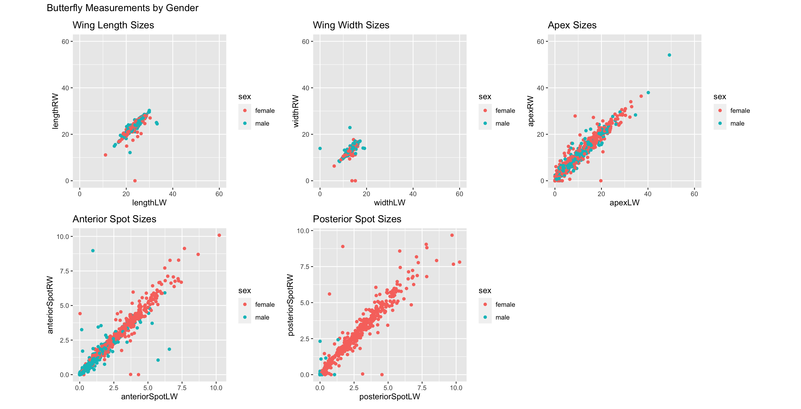

# ButterflyQuery.R
An R query built upon a dataset of butterflies collected by several different colleges with the purpose of data cleaning. Created for DATA-331.

# ButterflyAnalysis.R
An analysis of the clean data from ButterflyQuery.R, complete with visualizations and a t-test

# Questions we asked of our data
**1) How do measurements differ based on sex?**
* To test this we created multiple scatterplots using ggplot2 and patchwork
``` r
plot(length_scatterPlot + width_scatterPlot + apex_scatterPlot +
       anteriorSpot_scatterPlot +
       posteriorSpot_scatterPlot +
       plot_layout(ncol = 3)) +
       plot_annotation("Butterfly Measurements by Gender")
```

Resulting Image



* Largest differences found within posterior spots, anterior spots, and the wing apexes

**2) Can we predict sex based on measurements?**
* To test this we created a decision tree using library(party)
* We then tested this decision tree with confusion matrices
``` r
treeReduced <- ctree(sex ~ ., df_butterfly_training_reduced, controls = ctree_control(mincriterion = .95, testtype = "MonteCarlo")) %T>%
  plot()
  
df_treeReduced <- as.data.frame(table(predict(treeReduced, newdata = df_butterfly_testing_reduced), df_butterfly_testing_reduced$sex))

treePlot <- ggplot(df_treeReduced, aes(x = Var1, y = Var2, fill = Freq)) +
  geom_tile() + geom_text(aes(label=Freq)) +
  scale_fill_gradient(low="white", high="#177244") +
  labs(x = "Reference", y = "Prediction") +
  scale_x_discrete(labels=c("Female", "Male")) +
  scale_y_discrete(labels=c("Female", "Male"))

plot(treePlot)
```
Resulting Image


* Wing apex and posterior spots are the largest indicators of sex amongst cabbage butterflies
* The confusion matrices show that our decision tree is extremely accurate in its predicitons of sex

**3) Where were these butterflies gathered?**
* To test this we used a geospatial map of the US and UK and overlayed geom_density2d from  ggplot2 on top

``` r
ggplot() +
  scale_x_continuous(limits = c(-140, -48), expand = c(0, 0), labels = NULL, breaks = NULL) +
  scale_y_continuous(limits = c(20, 55), expand = c(0, 0), labels = NULL, breaks = NULL) +
  geom_density2d_filled(data =  df_us, aes(longitude, latitude, color = "red"), contour_var = "ndensity") +
  geom_map(data = mapNorthAmerica, map = mapNorthAmerica, aes(map_id = region), fill = NA, color = "black") +
  geom_point(data = df_us, aes(longitude, latitude, size = numberOfObservations)) +
  theme(panel.grid = element_blank(), panel.border = element_blank())

ggplot() +
  scale_x_continuous(limits = c(-12, 5), expand = c(0, 0), labels = NULL, breaks = NULL) +
  scale_y_continuous(limits = c(49, 60), expand = c(0, 0), labels = NULL, breaks = NULL) +
  geom_density2d_filled(data =  df_uk, aes(longitude, latitude, color = "red"), contour_var = "ndensity", bins = 15, adjust = 2) +
  geom_map(data = mapUnitedKingdom, map = mapUnitedKingdom, aes(map_id = region), fill = NA, color = "black") +
  geom_point(data = df_uk, aes(longitude, latitude, size = numberOfObservations)) +
  theme(panel.grid = element_blank(), panel.border = element_blank())
  ```
  
  Resulting Image
  
  
  
  
  * We see the greatest density of butterflies in the US were found in Virginia, West Virginia, and Maryland
  * We see the geratest density of butterflies in the UK were found in London
  
  # T-Test
  * We wanted to see if wing areas (wing lengths * wing widths) were dependent of sex
  * We used a Welch two-sample T-test which returned **t = -0.4301, df = 742.64, p-value = 0.6672**
    alternative hypothesis: true difference in means between group female and group male is not equal to 0
    95 percent confidence interval: -10.114389   6.479004, sample estimates: mean in group female 307.7330 &
    mean in group male 309.5507 
  * This supports the findings of our decision tree which shows that wing length and wing width are not indicators of sex
    amongst cabbage butterflies
